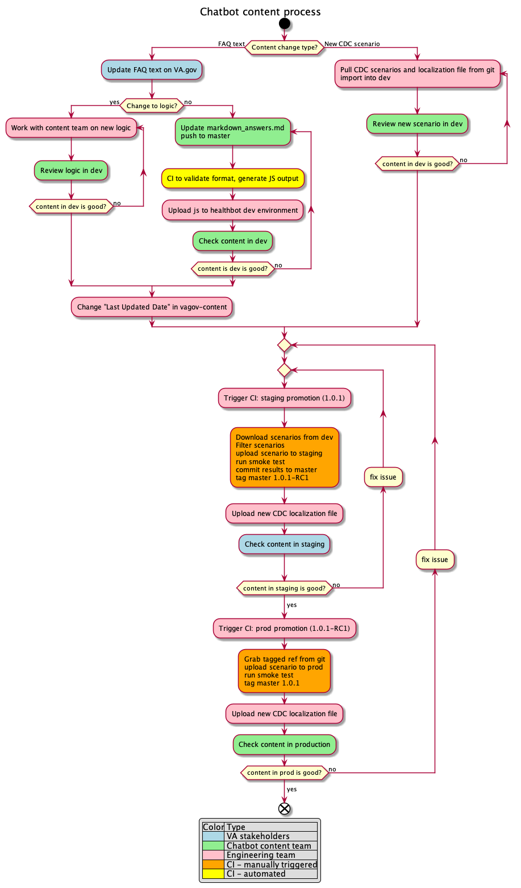

# Process for updating Chatbot copy 
- Ensure that the content has been approved by the Content team
- Make changes to [markdown files][https://github.com/department-of-veterans-affairs/covid19-chatbot/tree/master/content] in Github 
- Create an issue on Github for one or multiple related edits to the content copy. And tag the issue with the label content_change and attach a severity label to the issue, one amongst Severity 1 - Critical, Severity 2 - High, Severity 3 - Medium, Severity 4 - Low.
- OR
- Provide a short description of the content changes required and send a message on the Slack channel '#covid-19-chatbots' and tag @Ramya Ramesh and @Jeddalyn Puzon
- Any Severity 1 and Severity 2 issues will be attempted to be addressed as soon as possible. 
- The team will review all content_change issues as part of the regular grooming process and pull them into the team 

# Process for updating the content within the Chatbot
- User updates markdown file 
- Markdown file is turned into Javascript (automatically) #168
- File needs to be uploaded to healthbot (manually) 
- Once QA passes, automated process to move from DEV →  Staging →  Prod 
  - A script needs to be created 
  - Jenkins job to run the script
  
## Open Questions 
- What will the frequency be for uploading a file to healthbot? 
> A: Once a day (determine a set time) 
- Who needs to be involved to get changes from DEV →  Staging →  Prod? Who has access to be able to do this?

# Content process
Flow diagram for content changes

