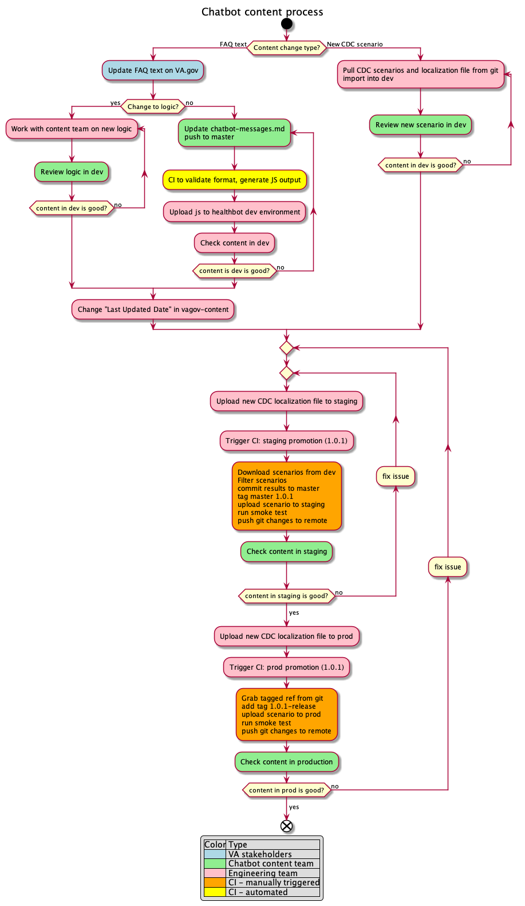

# Process for updating Chatbot copy 
- Ensure that the content has been approved by the Content team
- Create an issue on Github for one or multiple related edits to the content copy. And tag the issue with the label content_change and attach a severity label to the issue, one amongst Severity 1 - Critical, Severity 2 - High, Severity 3 - Medium, Severity 4 - Low.
- Make changes to markdown files[https://github.com/department-of-veterans-affairs/covid19-chatbot/tree/master/content] in Github
- Any Severity 1 and Severity 2 issues will be attempted to be addressed as soon as possible. 
- The team will review all content_change issues as part of the regular grooming process and pull them into the team 

# Process for updating the content within the Chatbot
- Content editor updates markdown file
- Markdown file is turned into Javascript (automatically) #168
- File needs to be uploaded to healthbot (manually) 
- Once QA passes, automated process to move from DEV →  Staging →  Prod 
  - A script needs to be created 
  - Jenkins job to run the script
- The team will push regular content change requests received to Prod twice every week, on Monday's and Thursdays. Additionally, if there are any critical updates that are required, the team will make such changes available on Prod as needed. 
  - If a Holiday falls on a Monday, content change will happen the following business day
  
## Open Questions 
- Who needs to be involved to get changes from DEV →  Staging →  Prod? Who has access to be able to do this?

# Content process
Flow diagram for content changes

