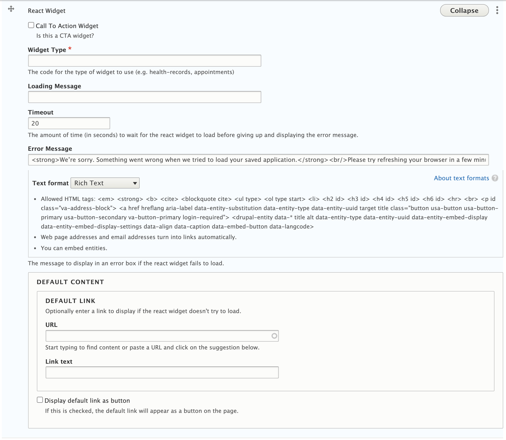
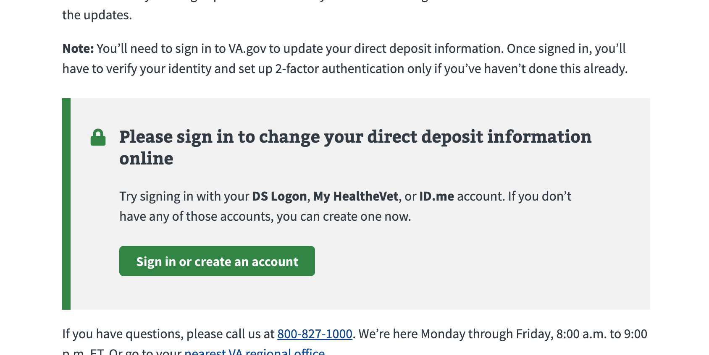
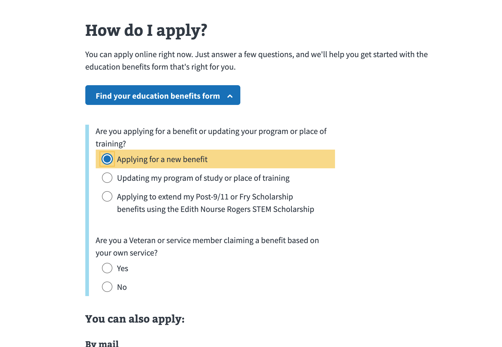
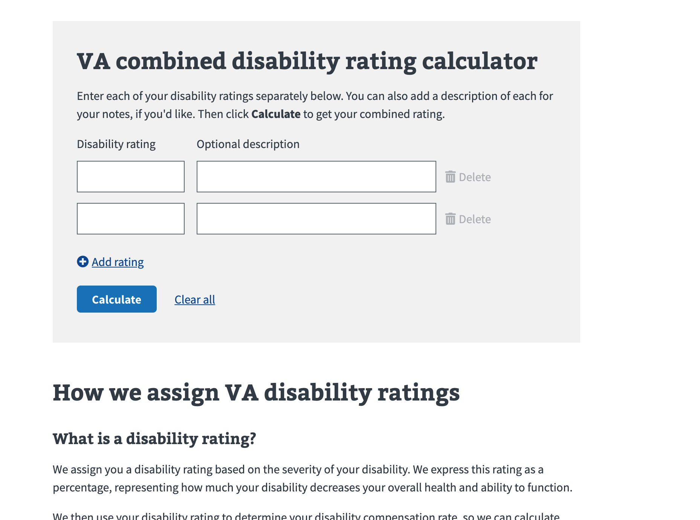
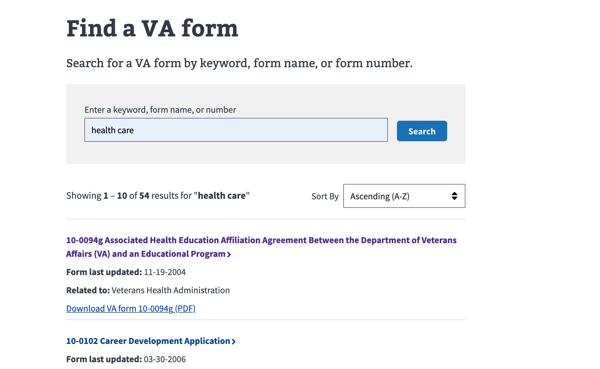

# CMS data in menus, widgets, APIs, and more
There are several instances of CMS data integrating into the website in ways other than creating a page or article. In general, this process is to fetch data from the CMS via the CMS GraphQL API. Then, after receiving the response data from the CMS, write the data in a local cache such as into templates or a local database. This document covers the following cases -

- [Menus](#menus) 
- [Widgets](#widgets)
- [APIs](#apis)
- [Homepage banner](#homepage-banner)

## Menus
Menus including the MegaMenu and the various sidebars exist as separate data structures from the article data structures. The relationships between the article and the menus are formed during the Front-End build.

### The MegaMenu
The _MegaMenu_ refers to the main website navigation, just under the logo at the top of the website. The data flow is as follows -

1. The front-end build fetches data from the CMS via a dedicated [GraphQL query](https://github.com/department-of-veterans-affairs/vets-website/blob/3427bfa741a3adc8338745d2ecf284204b6749ce/src/site/stages/build/drupal/graphql/navigation-fragments/menuLinks.nav.graphql.js). Note that this is a type of GraphQL query different from that of pages (which use a `nodeQuery`), called a `menuLinkContentQuery`.
2. After the GraphQL response data is received, the front-end build manipulates the shape of the data in a dedicated [function](https://github.com/department-of-veterans-affairs/vets-website/blob/c55bdb03b39ce99ef48690038f82b0da2cfd0a13/src/site/stages/build/drupal/menus.js#L267) to match the expected prop format of the MegaMenu React component, which will be covered later.
3. A [custom Metalsmith plugin](https://github.com/department-of-veterans-affairs/vets-website/blob/c55bdb03b39ce99ef48690038f82b0da2cfd0a13/src/site/stages/build/plugins/create-header-footer.js) serializes the MegaMenu data and marks it as a global variable throughout all templates via `metalsmith.metadata`.
4. The MegaMenu data is written into the body of all HTML pages in the [header template](https://github.com/department-of-veterans-affairs/vets-website/blob/c55bdb03b39ce99ef48690038f82b0da2cfd0a13/src/site/includes/header.html#L87), which is used by all modernized VA.gov pages. The data is available under the global `window` object.
5. During startup, the MegaMenu data is grabbed from the `window` object and passed to the [MegaMenu React component](https://github.com/department-of-veterans-affairs/vets-website/blob/c55bdb03b39ce99ef48690038f82b0da2cfd0a13/src/platform/site-wide/index.js#L49).

### Sidebars

## Widgets
A _widget_ is a special type of Drupal paragraph that largely serves to set up a DOM element for a React component to bind to and start up on the page. Ultimately, they are useful when there is a block of interactivity on a page that is otherwise static content in the CMS.

The form an editor uses to add a React widget

  

  

There are a few text fields for defining things like the message shown while loading, but the most important field is the __Widget Type__. This is the unique identifier for the widget, which will be used to form the relationship with the corresponding front-end React code. These fields are then processed through the [React Widget template](https://github.com/department-of-veterans-affairs/vets-website/blob/1c1e54f76f2984a6fbe40246c21aa1d220ac52d2/src/site/paragraphs/react_widget.drupal.liquid), which shows a loading indicator before the React code is ready. 

The complexity of these widgets can range from very simple to very complex. Examples include -

Call-to-action (CTA) Widget

This is the most common type of widget. It renders as a banner that prompts the user to sign in to use a tool. 

Save-in-progress (SIP) Widget

This would render as a prompt for a user to continue their application if they had one saved already.
  

Wizard

Small widget that prompts the user with a list of questions to help guide them to the correct form.
  

Disability Rating Calculator

Located at https://www.va.gov/disability/about-disability-ratings/
  

Find Forms Search Widget

A search tool that is surrounded by static content. The API behind it is covered in the APIs section of this document.

A front-end engineer must register the widget-type in the [static-pages application code](https://github.com/department-of-veterans-affairs/vets-website/blob/1c1e54f76f2984a6fbe40246c21aa1d220ac52d2/src/applications/static-pages/widgetTypes.js) and execute their widget initialization function inside of the [static pages entry script](https://github.com/department-of-veterans-affairs/vets-website/blob/1c1e54f76f2984a6fbe40246c21aa1d220ac52d2/src/applications/static-pages/static-pages-entry.js).

## APIs
In some cases, data from the CMS is used to power APIs.

### Find Forms
The Find Forms application refers to the [search tool for VA forms](https://www.va.gov/find-forms/). Its historical data flow is very complex, with that history [documented extensively](https://github.com/department-of-veterans-affairs/va.gov-team/tree/master/products/find-a-va-form).

At the time of writing, the data flow is as follows -

1. In the CMS, a [nightly migration](https://github.com/department-of-veterans-affairs/va.gov-cms/blob/f4341c29ad8e998de1dac2fca0b749cdef15c923/READMES/migrations-forms.md) is executed to fetch data from the VA Forms legacy database. The VA Forms database provides key fields such as form names and form PDF URLs, while the CMS houses additional fields to complement that data, such as a description and online tool URL.
2. In a separate [migration](https://github.com/department-of-veterans-affairs/vets-api/blob/c66c3dee44f9bfa022f41c5a63c5cb5c34009b39/modules/va_forms/app/workers/va_forms/form_reloader.rb), the Lighthouse Forms API issues a [GraphQL query](https://github.com/department-of-veterans-affairs/vets-api/blob/c66c3dee44f9bfa022f41c5a63c5cb5c34009b39/modules/va_forms/config/graphql_query.txt) to fetch the forms data from the CMS.
3. A separate Vets-API [controller](https://github.com/department-of-veterans-affairs/vets-api/blob/c66c3dee44f9bfa022f41c5a63c5cb5c34009b39/app/controllers/v0/forms_controller.rb) exposes the Lighthouse Forms API to requests from va.gov. This is done because requests to the Lighthouse Forms API requires a secret key, which cannot be exposed to the browser.
4. Finally, the forms data is surfaced by the [Vets-API forms route](https://api.va.gov/v0/forms) for the Find Forms tool to leverage.

This [diagram](https://github.com/department-of-veterans-affairs/va.gov-team/blob/master/products/find-a-va-form/mvp/technical/forms-data-flow-Q3-2020.pdf) helps illustrate the data flow.

## The Homepage Banner
_The homepage banner is not backed by CMS data. Since this is such a common misconception, it is included in this document anyway._

The data flow for the homepage banner is as follows -

1. The data originates as a [YML document in vagov-content](https://github.com/department-of-veterans-affairs/vagov-content/blob/c6b94fa96b24b96adbce1096c28db6f451199d49/fragments/home/banner.yml)
2. A [custom Metalsmith plugin](https://github.com/department-of-veterans-affairs/vets-website/blob/c55bdb03b39ce99ef48690038f82b0da2cfd0a13/src/site/stages/build/drupal/home.js#L37) parses the YML file and stores the data in the entity representing the VA.gov homepage.
3. In the [header template](https://github.com/department-of-veterans-affairs/vets-website/blob/c55bdb03b39ce99ef48690038f82b0da2cfd0a13/src/site/includes/header.html#L120), the homepage banner data is written into the dataset of a DOM element
4. A [React component](https://github.com/department-of-veterans-affairs/vets-website/blob/c55bdb03b39ce99ef48690038f82b0da2cfd0a13/src/platform/site-wide/banners/index.js#L20) reads the data from the DOM
