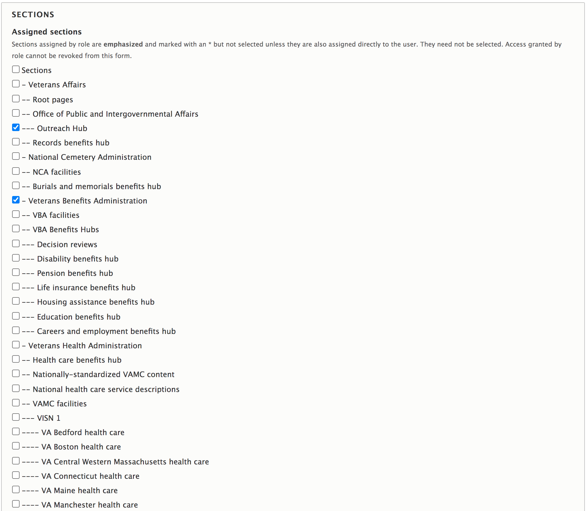

*This is a WIP, last updated March 29 2021.*

## About Sections

Sections are the means by which access is granted to *edit* content.

All content on the site is required to be associated with one section, and only one section.

Each CMS user is also associated with a section, or multiple section.

Sections are organized into a hierarchy that represents the goverance hierarchy of all content on VA.gov CMS. At the top of the hierarchy are the 3 Administrations (NCA, VBA, and VHA, plus DEPO and "Veterans Affairs", for primarily OPIA content.)

Editors can edit content associated to a specific section under three circumstances:

1. Their CMS user account is associated to the section tied to the content.
1. Their CMS user account is associated to a parent section (or grand-parent, or great-grandparent, etc) of the content.
1. Their CMS user account has "Content admin" or "Administrator" role (which bypass all Section settings).

Most CMS users (such as VAMC or Vet Center editors) only have one section in which they can create or edit content. Others may have access to multiple, individual sections. Because sections are organized hierarchically, editing access permissions cascade from top to bottom. For example, an editor who has access to the VHA section has access to all sections nested underneath, including the Health Care Benefits Hub, all Vet Centers, and all VAMC facilities. But CMS users with access to a specific VAMC System such as VA Seattle health care" may not add content to higher 'parent' level  "Veterans Health Administration" Section content, or edit belonging to it.

## Managing access to sections

When new users are added to VA.gov Drupal CMS, they are added to specific sections based on criteria outlined in a product's [User administration](../../user-administration/) policy. For example, an editor of a VAMC system will be added to their respective VAMC section. A VISN web master would typically have access to a parent section (and therefore all the VAMCs within that VISN level section).

`@todo link to user administration policy for each product`.

In this example, a user is associated with all of VBA sections, as well as the Outreach Hub section, allowing them to edit the Outreach Hub AND everything in every VBA section. 

## Making changes to sections

Sections are managed by CMS users with the "user admin" or "administrator" role, here:
https://prod.cms.va.gov/admin/structure/taxonomy/manage/administration/overview

Anyone can request a change to a section by [creating an issue on the CMS backlog with Section request template](https://github.com/department-of-veterans-affairs/va.gov-cms/issues/new?assignees=kevwalsh&labels=Section+request%2C+Content+governance&template=cms-section-request.md). 

Sections can be re-organized relatively easily by a user with this role, simply by dragging and dropping using this interface. However, this can have major repercussions for permissions across the site, and is not done lightly.

Occasionally, a section may be divided into two, to allow more granular access to content by different groups of users. For example, VA Forms section could theoretically be divided into "VA Forms VBA" and "VA Forms VHA", to allow discrete access to different groups for different VA Form detail pages. 

## Limitations of Sections architecture

`@todo Explain that a user's editorial workflow role is CMS-wide, and not section-specific. For example, a Content reviewer of one VAMC system cannot be a Content publisher of another VAMC system, etc.`
