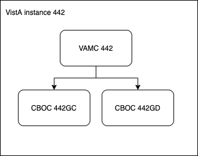

# VA location related terminology

## At a glance

- VistA site id: `sta3n`, `rootStationCode`, `siteId`, `systemId`
- VA location id: `sta6aid`, `institutionCode`, `facilityId` (except for MAS)
- VA parent location: `parentStationCode`, `facilityId` (except for MAS), `parentSiteCode`, `sta6aid`
- VistA clinic: `clinicId`

MAS (mobile appointment service):
- `facilityId` is a `sta3n`, a VistA site id
- `sta6aid` is a `sta6aid`, a VA locationid
- `clinicId` is a VistA clinic id

VistA/VAST
- VistA site
- Parent division
- Child division

## Overview

VA locations have a confusing hierarchy regarding where appointment data is stored. The current system of record is VistA, which is an old mainframe system. Instances of VistA are installed locally at different VAMCs and shared among multiple physical locations. When a Veteran visits ones of these facilities for the first time they're registered in the associated VistA site instance and get a VHA correlation identifier in MPI, the Master Person Index (previously called MVI).

When we schedule appointments, we schedule into specific "clinics" in a VistA instance, which are distinct from what people refer to as "VA clinics" or CBOCs. VistA clinics are abstract scheduling entities that are largely unstandardized across VistA sites. They might refer to a room in a VA medical center or to a team of doctors. But every appointment has a datetime, a site id, and a clinic id. Separately, in the datawarehouse system called CDW, those VistA clinics are associated with a facility id for the specific VA location where it is located, rather than the VistA site that may cover multiple physical locations.

The VA also has the concept of parent VAMCs. These parents VAMCs have child facilities that they manage and are associated with. Typically, these parent VAMCs are the equivalent to a VistA site. However, this is not always the case; some VAMCs are integrated and multiple "parent" VAMCs share the same VistA instance. This parent site hiearchy is accessible to us through CDW.

## Identifiers

- VistA instances always have three digit identifiers. This three digit identifier is officially called the `sta3n` identifier, but is often referred to as a site id or root station code. MAS (mobile appointment service) calls this id a `facilityId`, which is contrary to other uses of `facilityId`.
- VA locations are identified with a three digit id or a five character id, where the first three characters are the VistA site id and the last two characters are letters. So `552GK` would be an identifier for a location using the `552` VistA site.
- VA parent sites are VA locations that manage a group of other VA locations. Typically they're also a VistA site, but not always, so the identifier is a sta6aid, which can be 3 or 5 digits.
- VistA clinic ids are numeric ids, referencing abstract scheduling entities in a VistA site. They are not unique across the VA, they are unique within a VistA site. So a combination of VistA site id and clinic id will uniquely identify a clinic at the VA. They are also associated with a specific VA location in CDW, but the VistA site, rather than a parent location, technically owns a clinic.

## Site and facility relationship

Most of the time, a VistA site contains a VAMC, identified with an sta3n code, as well as a collection of CBOCs, with sta6aid codes. All these facilities are part of the same VA health system, and are part of a VISN with other health systems.

(Not all CBOCs in this site are shown)

In the above screenshot, we'd typically call 442 a parent site.

In a limited number of cases, VA health systems have been consolidated into a single VistA instance. In that case, there are multiple, independent health systems in a single instance:

In this case, there are four locations we'd call parent sites, and they have sta6aid codes, rather than only sta3n codes.

