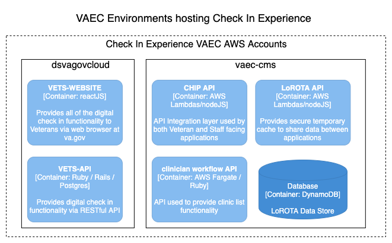
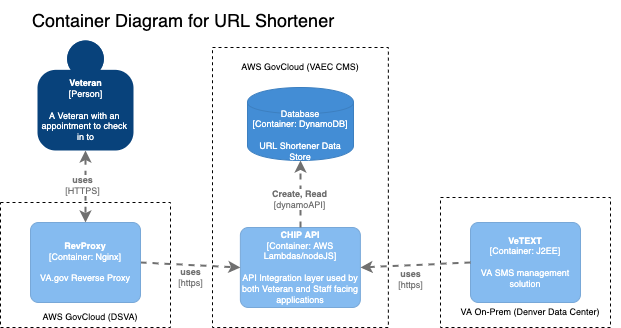
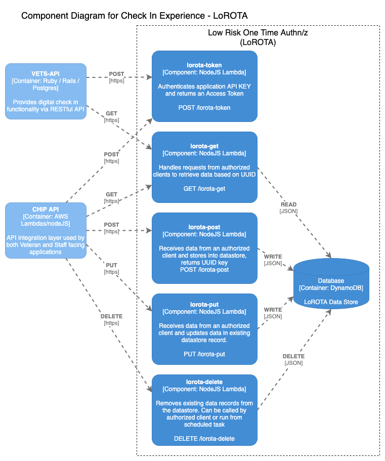

# Check In Experience Architecture

## What is Check In Experience (CIE)?

Check In Experience is a VA.gov product that will allow a Veteran with an appointment to check in for that appointment on the va.gov website using a mobile device. The Check In Integration Platform (CHIP) integration layer also supports functionality required by two staff facing applications.

## Check In Experience System Architecture:

Check In Experience consists of muliple code bases deployed to two different AWS environments. vets-website and vets-api are deployed to the `dsvagovcloud` AWS account and CHIP, LoROTA and clinician-workflow are deployed to the `vaec-cms` AWS account.  CIE also makes calls to Twilio for SMS support and to VA On-Prem services to access VistA data.

## Check In Experience Containers:

Check In Experience consists of five main containers (see components section for details):

- vets-website
- vets-api
- CHIP
- Lorota
- Clinician Workflow

## Check In Experience Components/Information:

### vets-website

- Provides the Veteran facing UX
- Built with reactJS
- Calls vets-api to:
  - Establish session
  - Authorize Veteran based on matched phone number, lastName and lastFour
  - Refresh list of appointments
  - Check in for a specific appointment
- [vets-website Architecture](https://depo-platform-documentation.scrollhelp.site/developer-docs/Frontend-architecture.1855324196.html)

#

### vets-api

- Provides the immediate back end API for vets-website
- Built with Ruby on Rails
- Creates redis cache for each UUID to store access token
- Calls CHIP to:
  - Trigger refresh of Veteran appointment data in Lorota
  - Check in for a specific appointment
- Calls Lorota to GET Veteran appointment/demographic data
- [vets-api Architecture](https://depo-platform-documentation.scrollhelp.site/developer-docs/Overview.844955712.html)

#

### URL Shortener

- Provides a URL shortening service under the www.va.gov namespace
- An API for creating shortened URLs is available to the CHIP & VEText teams
- Shortened URLs are available under the www.va.gov/c/ path immediately after creation
- Create & Read endpoints are AWS Lambda functions built with nodeJS
- The Read endpoint is served to Veterans via the [VA.gov Reverse Proxy](https://vfs.atlassian.net/wiki/spaces/OT/pages/1474594232/Reverse+Proxy)
- [URL Shortener Documentation](https://github.com/department-of-veterans-affairs/va.gov-team/tree/master/products/health-care/checkin/engineering/url-shortener)

### Check In Integration Platform (CHIP):

- Provides integration layer for access to various services including VistA and SMS messaging with Veteran
- AWS Lambda built with nodeJS
- POSTs Veteran appointment / demographic data to Lorota
- POSTs SMS content to Twilio
- Calls vista-api-service to:
  - GET Veteran appointment / demographic data
  - POST check in for a specific appointment

#

### Low Risk One Time Authn/z (Lorota)

- Provides a simple service that uses a unique key(UUID) passed between a user and various services to authenticate that user for certain low risk activities
- AWS Lambda built with nodeJS and AWS DynamoDB
- [LoTORA Documentation](https://github.com/department-of-veterans-affairs/lorota/blob/master/README.md)

#

### vista-api-service

- Provides REST interface for all VistA interaction
- JEE solution hosted at VA OnPrem data center
- Red Hat Enterprise Linux Server release 7.9 (Maipo)

#

### clinician-workflow

- Provides functionality related to grouping of clinics for VSE CS staff facing appliction
- Ruby something something Fargate
- Supports connection to VistA-api-service for Veteran and Staff facing applications

[clinician workflow context and sequence diagrams](https://github.com/department-of-veterans-affairs/clinician_workflow/blob/master/docs/Check-In-Experience.md#check-in-experience-context-diagram)
