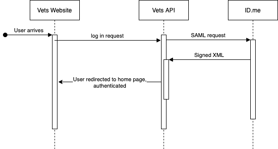
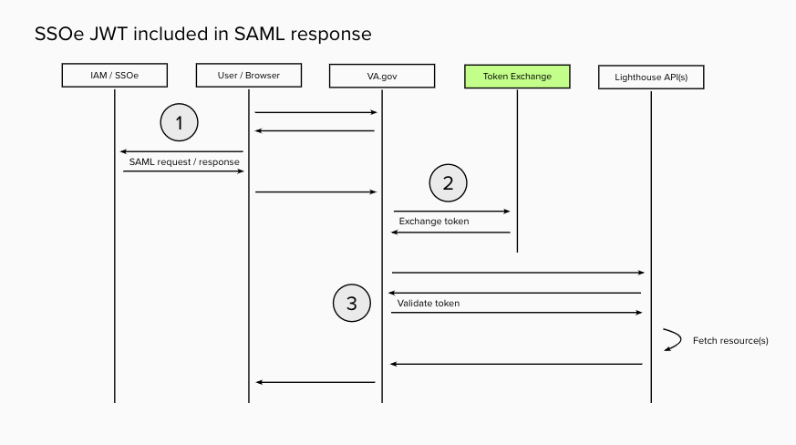

# Auth Diagram and explinations [WIP]

This document's goal is to provide converstion starters, as well as jumping off points for discovery on Authentications

## General VA Auth

**Start here** [The latest VA auth docs are](https://github.com/department-of-veterans-affairs/va.gov-team/blob/master/products/identity-personalization/login/reference-documents/auth/authentication-and-authorization.md) with the full [`UML` and `md`](https://github.com/department-of-veterans-affairs/va.gov-team/tree/master/products/identity-personalization/login/reference-documents/auth)

## ID.me 

[ID.me](https://github.com/department-of-veterans-affairs/devops/blob/master/docs/External%20Service%20Integrations/ID.me.md)is an authentication provider. 

ID.me uses a basic SAML exchange to provide authorization for a user. A user can sign in with a variety of credentials, including [DS Logon](), [My Health-eVet](), or [ID.me](). Currently the VA is trying to get to reduce those 3 providers to only use one, ID.me

Much of the authorization and authorization on an external system (ID.me) and we (vets api and va.gov) consume the authorized user using SAML. 

For a more detailed breakdown, head over to [here](https://github.com/department-of-veterans-affairs/va.gov-team/blob/master/products/identity-personalization/login/user-login/login-data-flow.md)

## My Healthy-eVet

*[Link to team docs](https://github.com/department-of-veterans-affairs/devops/blob/master/docs/External%20Service%20Integrations/My%20Healthe%20Vet.md)*

We are not directly using My Healthy-eVet for authentications. All operation to interact with my healthy vet happen in one of two ways, either through ID.me or through REST endpoints. 

Interactions with ID.me happening according to the [documentation here](https://github.com/department-of-veterans-affairs/va.gov-team/blob/master/products/identity-personalization/login/reference-documents/login/fe-login-and-logout.md).

## Lighthouse - Non health API

For non health data, we use an API that is was given to the API team to use with each request. This key was generated 

## Lighthouse - Health API 

Normally, if an outside system wants to consume Health data from Lighthouse, they would use Open ID connect. OpenId Connect is a layer on top of OAuth.

In order to not reinvent the wheel, the Lighthouse team uses Okta as their OAuth broker with ID.me, DSLogon and MHV. 

But the vets api is a unique integration point. We cannot use the existing OAuth system because the vets api is already using a different OAuth system. 

To solve that problem, the Lighthouse team is creating a custom integration point. 

As of Sept 3, 2020, The integration is not finalized. The diagram is a screen grab from their latest mural.

