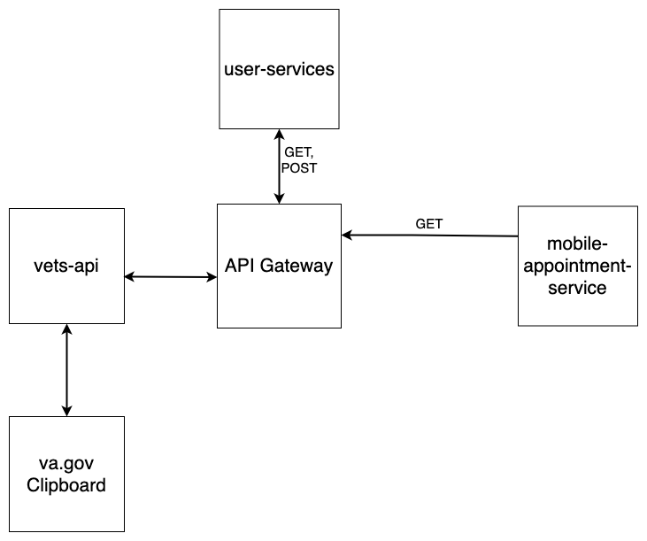
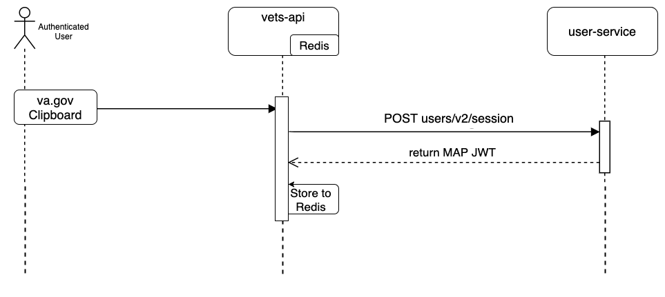
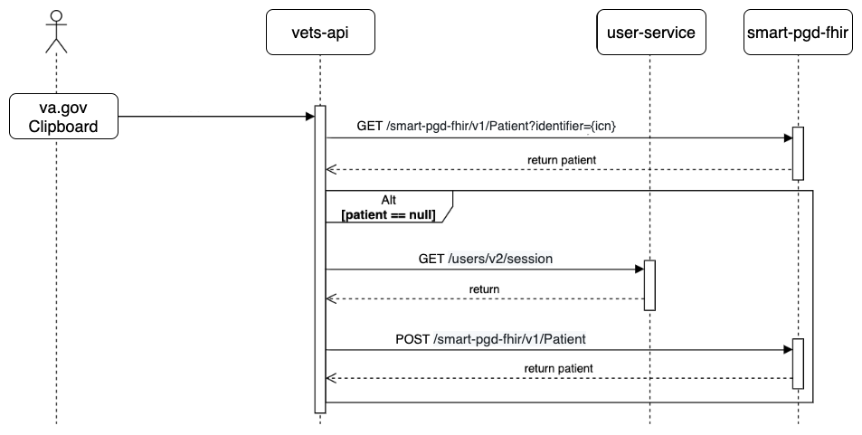

# va.gov Clipboard System Design Document (SDD)

# Mobile Application Information

- Repository: [vets-website]() [vets-api]()
- Major Release: 1.x

## Purpose

Our goal is to improve the in-person and online pre- and post-appointment experiences for Veterans, contribute to physical distancing efforts in VA facilities, and better integrate Veteran-provided data in VA workflows by providing Veterans with a digital option to complete pre- or post-appointment questionnaires and screeners.

## Problem Statement

Veterans unable to consistently share and update current health status and medical history that is leveraged in their care across the VA and community providers

## Job To Be Done

When going to a healthcare visit, I want to share my current health status and medical history so that my information can influence and be used to create my treatement plan accross the coninium of care.

VA has implemented a FHIR API that provides external access to Veteran personal health information in the Patient Generated Data (PGD) database in a standardized FHIR format.

VA wants to deliver an intuitive, accessible, and consistent experience in a personalized and engaging platform to enable Veterans and their caregivers to manage their health and well-being. As the VA expands their digital mobile health portfolio, there is a demand to organize the way veterans engage with their care within the VA.

The va.gov Clipboard application will provide Veterans that primarily use va.gov as their entrypoint to VA Digital Resources the ability to view and complete Questionnaires. The UX will be within the existing va.gov ecosystem that provides an intuitive and familiar experience across the va.gov digital products.

Use Cases:

- When an authenticated Veteran navigates to the Clipboard application on va.gov, a list of outstanding Questionnaires will be displayed. Selecting a Questionnaire will launch a form for the Veteran to complete the Questionnaire. The Veteran will also have an option to view past history of completed Questionnaire Responses.

- Partner applications may utilize the Clipboard application to provide a link to a Questionnaire within the partner application. This link will contain the necessary information to launch the correct Questionnaire for the Veteran to complete. If the Veteran has not been authenticated they will be directed to the logon workflow on va.gov and then redirected to the Questionnaire.

- TODO other use cases?

This is the initial relase of the application, V1 of the Clipboard application on va.gov.

## High-Level App Categorization

### Intended Audience

- [x] Veteran
- [ ] Caregiver
- [ ] Provider
- [ ] Public

### Software Type

- [ ] Service
- [x] App
- [ ] Background Process
- [ ] Other: <Specify>

### Data Access / Storage Overview

| **Data Type**                 |     **VAMF/VA Source**     | **CRUD Operations** | **Data Classification** | **Reason / Requirement**                                                             |
| :---------------------------- | :------------------------: | :-----------------: | :---------------------- | :----------------------------------------------------------------------------------- |
| Patient record                |   smart-pgd-fhir-service   |         CR          | PII                     | Create Patient resource if it does not exist                                         |
| QuestionnaireResponse records |   smart-pgd-fhir-service   |        CRUD         | PHI                     | Manage appointment pre-visit agenda & supplemental family member history information |
| Questionnaire records         |   smart-pgd-fhir-service   |          R          | PHI                     | Required as references in QuestionnaireResponse related requests                     |
| Appointment records           | mobile-appointment-service |          R          | PHI                     | Discover upcoming appointments                                                       |

### Data Sensitivty Classification (Mobile App Classification)

- [ ] 1 – Very Low: Mobile Application does not use VA Resource
- [ ] 2 – Low: Read only access to VA Resource(s) (No PII / PHI)
- [ ] 3 – Medium: Write access to VA Resource(s)
- [x] 4 – High: Read and/or Write access of sensitive data to VA and/or MAP Resource(s) (Includes PII/PHI/other sensitive)

# Conceptual Design

---

- The Clipboard application is built using the [VA Forms System](https://department-of-veterans-affairs.github.io/veteran-facing-services-tools/forms) which provides a consistent experience for complex forms presented to Veterans.
- Leverages MAP Services - User Service, Mobile Appointment Service, SMART PGD FHIR.
- Networks with vets-api service layer to facilitate calls between va.gov and MAP Services.

## Conceptual Diagram



## Data Entered / Retrieved with Application

The following describes top level data elements entered by the user into the application:

| **Data Element**             | **Brief Description**                                   | **Where Persisted** |
| :--------------------------- | :------------------------------------------------------ | :------------------ |
| Appointment Pre-Visit Agenda | Questions/Answers pertaining to an upcoming appointment | smart-pgd-fhir      |

All data elements persisted in smart-pgd-fhir will have the [Clipboard Provenance/Source mapping](). Additional information on how the data elements are persisted in smart-pgd-fhir can be found in the official Clipboard FHIR mappings at [url text](url).

# Logical Design Perspective

## Component View

- **Clipboard va.gov web application** - The user facing web application that is the subject of this SDD.
- **Vets-api middleware** - The service layer providing abstraction between va.gov and external systems
- **User Service** - The User Service is a microservice that operates on the current user session; providing login/logout cababilities. User-Service will be used to facilitate the exchange of a va.gov token for a MAP JWT.
- **API Gateway** - The API Gateway is a customized Nginx-openresty based solution that enables the Mobile NextGen architecture to create a microservice-based architecture.
- **Mobile Appointment Service** - The Mobile Appointment Service is a microservice that is used to retrieve patient appointment information (used to create Appointment Pre-Visit Agendas).
- **SMART PGD FHIR Service** - The SMART PGD FHIR Service is a microservice used to retrieve and persist Patient Generated Data (PGD). All data entered via the Clipboard application is persisted via this service.

## Interface Design

**Login/Authentication**

The Clipboard Application utilizes existing credentialing workflows on va.gov. Once the user is authenticated a Token is sent on the users behalf to the MAP user-service [JWT Exchange workflow](https://coderepo.mobilehealth.va.gov/projects/IUMS/repos/user-service/browse/docs/externalJwtExchange.md). The validated JWT is returned to vets-api and used for all subsequent calls to MAP resources. More information on the authentication and authorization workflow is available in the [va.gov authentication flow description document](vaos_vagov_authFlow.md).  The MAP JWT expires after 10 minutes and is never exposed to the client application.


The MAP JWT is stored in a secure Redis instance and corelated to the authenticated user with a UUID:
```Ruby
module HealthQuest
  class SessionStore < Common::RedisStore
    redis_store REDIS_CONFIG[:va_mobile_session][:namespace]
    redis_ttl REDIS_CONFIG[:va_mobile_session][:each_ttl]
    redis_key :account_uuid
    attribute :account_uuid, String
    attribute :token, String
  end
end
```



**Get/Create Patient**

After login/authentication, the application will attempt to retrieve the user's Patient resource within SMART-PGD-FHIR. If the user does not have an existing Patient resource, then one will be created with the user name, ICN as an identifier, and Clipboard Provenance/Source Mapping.



**Get Past Questionnaire Response Resources**
The Clipboard Application will call smart-pgd-fhir service to retrieve all Questionnaire Response Resources associated with a user ICN. This data will be parsed and displayed to the user as a history of past Questionnaire Responses, as well as used to pre-fill data fields on new Questionnaire Responses, as appropriate.


**Get all Questionnaires created by the Clipboard application**
The Clipboard application will display available Questionnaires to Staff users of the VEText and VA Notify applications so that specific Questionnaires can be included in the notifications sent to Veterans. 


**Get Appointment Pre-Visit Agenda Questionnaire**
The Clipboard Application will call the mobile-appointment-service endpoint to retrieve upcoming appointments associated with the Veteran. Based on the Synthetic ID of the returned appointements and the ICN, existing Questionnaire Response (QR) Resources will be queried. If there is no QR Resource already associated with this Appointment ID, the approptiate Questionnaire Resource will be retrieved


**Post Questionnaire Response for Pre-Visit Agenda Questionnaire**
When the user has completed the form in the Clipboard Application and tapped Submit, a JSON object will be passed to vets-api. Vets-api will format the JSON into a QuestionnaireResponse Resource and POST to smart-pgd-fhir service to persist the Questionnaire Response in the PGD.


**Put | Delete Questionnaire Response**
In some scenarios, a Clipboard application user may be able to edit or delete an existing QuestionnaireResponse.


The following are a list of requests that are made by the Clipboard Mobile application:

| **Endpoint Called**                                                             | **HTTP Action** | **Mobile/External Service** | **Description**                                                                                                                          |
| :------------------------------------------------------------------------------ | :-------------- | :-------------------------- | :--------------------------------------------------------------------------------------------------------------------------------------- |
| /users/v2/session                                                               | POST, GET       | user-service                | POST Facilitates JWT Exchange Workflow and GET provides details to create a new Patient Resource                                                                                          |
| /smart-pgd-fhir/v1/Patient?identifier={icn}&\_sort:desc=\_lastUpdated&\_count=1 | GET             | smart-pgd-fhir              | Retrieves the user's Patient resource from SMART PGD FHIR via their ICN.                                                                 |
| /smart-pgd-fhir/v1/Patient                                                      | POST            | smart-pgd-fhir              | Creates the user's Patient resource in SMART PGD FHIR                                                                                    |
| /smart-pgd-fhir/v1/Questionnaire?id={questionnaire-title}                       | GET             | smart-pgd-fhir              | Retrieves a Questionnaire with matching id, which is used as a reference in subsequent QuestionnaireResponse requests to SMART PGD FHIR. |
| /smart-pgd-fhir/v1//Questionnaire?publisher=clipboard.gov.va                       | GET             | smart-pgd-fhir           | Retrieves all Questionnaires created by the Clipboard application |
| /smart-pgd-fhir/v1/QuestionnaireResponse?subject={appointment-id}               | GET             | smart-pgd-fhir              | Retrieves a QuestionnaireResponse, where the subject is equal to a given appointment id, from SMART PGD FHIR                             |
| /smart-pgd-fhir/v1/QuestionnaireResponse                                        | POST            | smart-pgd-fhir              | Creates a QuestionnaireResponse in SMART PGD FHIR                                                                                        |
| /smart-pgd-fhir/v1/QuestionnaireResponse?author={user-id}                       | GET             | smart-pgd-fhir              | Retrieves all QuestionnaireResponses, where the QuestionnaireResponse.author field is equal to the user id, from SMART PGD               |
| /smart-pgd-fhir/v1/QuestionnaireResponse/{id}                                   | PUT, DELETE          | smart-pgd-fhir              | Update or Delete a QuestionnaireResponse in SMART PGD FHIR                                                                                        |
| /patients/{icn}/appointments                                                    | GET             | mobile-appointment-service  | Retrieves appointments for the given user                                                                                                |

## Tech Stack :

| **Question**                                                                                                              | **YES** | **NO** | **Comment - explain why you are using non-standard technologies** |
| :------------------------------------------------------------------------------------------------------------------------ | :-----: | :----: | :---------------------------------------------------------------: |
| Are you using any technologies that are not on this page<br> https://wiki.mobilehealth.va.gov/display/DevHelp/Tech+Stack? |    X    |        |             vets-api is built on the Rails platform and utilzes Ruby as part of this service layer               |
| Are you planning to use up to date versions?                                                                              |    X    |        |                                                                   |

### Additions / Deviations from Tech Stack

The Clipboard application is being built as part of the va.gov / vets-api platform and thus conforms to the tech stack associated with those platforms.  Notably, Rails is the framework supporting vets-api and is not part of the MAP tech stack linked above.  

## Logical Persistence Model :

Redis is used as a temporary store for corelation of user session UUID with the MAP JWT

## Physical Design Perspective :

### Deployment Environment

The Clipboard Application front end will be deployed to the [existing va.gov infrastucture](https://github.com/department-of-veterans-affairs/vets-website) and backend will be deployed to the existing [vets-api infrastructure](https://github.com/department-of-veterans-affairs/vets-api). Both va.gov and vets-api have Dev, Staging and Production instances that will connect to the appropriate environment in MAP.

## Security :

The Clipboard application authenticates with the existing va.gov authentication workflow and then obtains a MAP JWT via the user service JWT Exchange workflow. The application can then use the JWT to make additional service calls within the MAP environment.

# Developer & PM Contact Information

[Clipboard Team on Github](https://github.com/department-of-veterans-affairs/va.gov-team/blob/master/teams/health-products/healthcare-experience/team-charter.md#who-we-are)
| **Developer Name/Point of Contact (POC)** | **VA E-Mail Address** | **Phone Number** |
| :---------------------------------------: | :---------------------: | :-------------------: |
| Stephen Barrs/Dept of Veterans Affairs | stephen.barrs@va.gov | 727.295.6998 |
| **Contract Development Team** | **VA E-Mail Address** | **Phone Number** |
| Amanda Buckley | amanda.buckley@va.gov | |
| Mark Dewey | mark.dewey@va.gov | |
| Laurence Guild | laurence.guild@va.gov | |
| Dillo Raju |||
| **Developer Organization/Company** | **Contract Start Date** | **Contract End Date** |
| GCIO | | |
| **Office of the VA CTO PM or POC** | **VA E-Mail Address** | **Phone Number** |
| Ming Ligh | ming.ligh@va.gov | |
| Lauren Alexanderson |lauren.alexanderson@va.gov||
| Patrick Bateman | patrick.bateman@va.gov | |
| | | |

## Appendix
