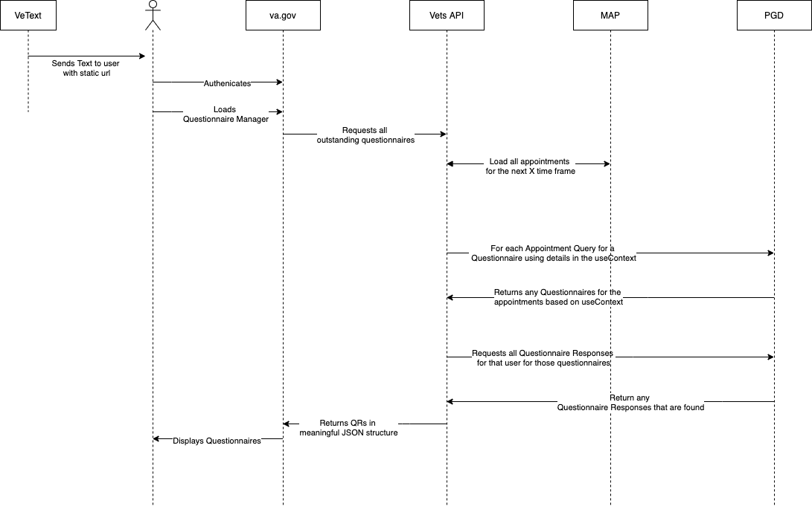

# Using FHIR Context

## Meetings

- 12/17/2020 - Attendees: Dillo Raju, Mark Dewey

## Refined Problem Statement

Our system needs to know when a veteran has a questionnaire.

## Moving to lighthouse

The decision was made by DEPO to move from using the PGD in MAP to using the PGD in the Lighthous FHIR API. This decision was made from stakeholders.

## Implications for the trigger

This move looks to make the engineering solution look easier at first pass. Instead of using a local database to store the association, We can use a Questionnaire resource to store the relationship.

In the [newest version of FHIR](https://www.hl7.org/fhir/questionnaire.html), there is a new field called [useContext](https://www.hl7.org/fhir/questionnaire-definitions.html#Questionnaire.useContext). In this field we can store and search data.

## useContext

In this `useContext` field, we would store the clinic id, and facility id. The structure will be left up to the back end team to settle on but it will something like

```json
   "useContext": [
      {
        "code": {
          "system": "http://link/to/facility/in/some/system/facilty/983",
          "code": "983"
        },
            {
        "code": {
          "system": "http://link/to/clinic/in/some/system/848",
          "code": "848"
        },
    ],
```


According to th FHIR spec, this is a searchable field.

## High level flow

To check if a veteran has an appointment, we will check per appointment.



