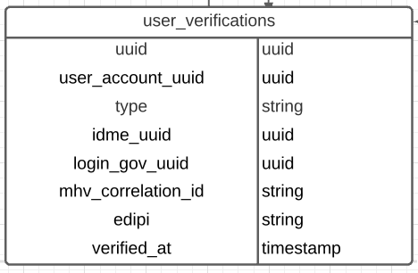
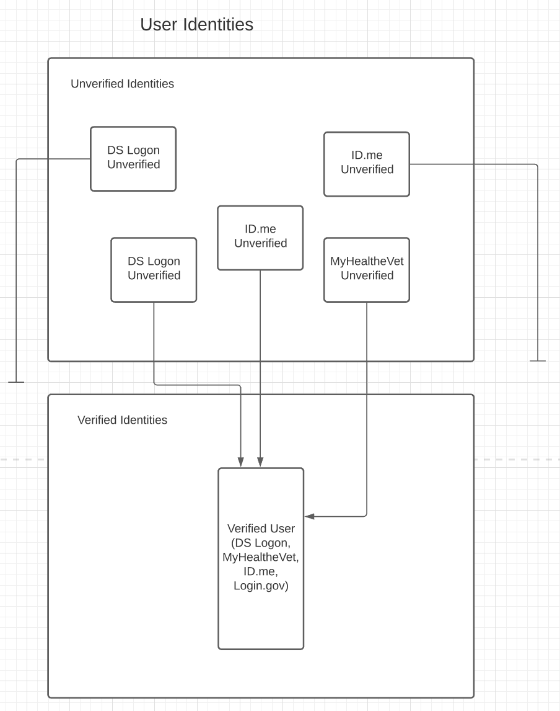
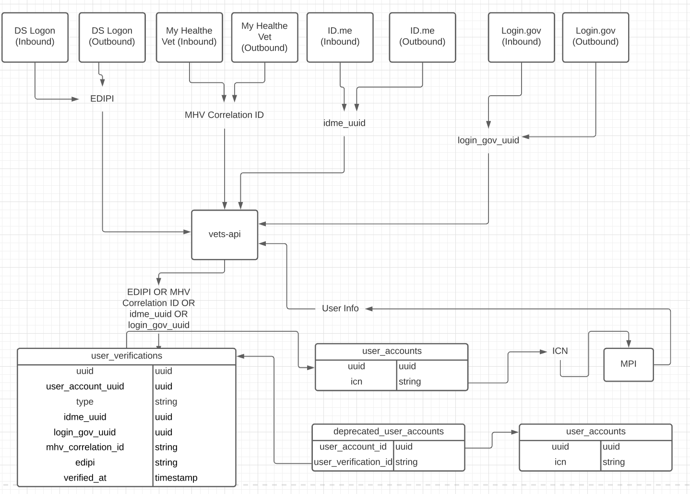

# User Accounts

## Proposal

* Every time a user logs in, they are correlated with a single `user_verifications` record. This record represents the credential_user, meaning this information is useful for determining the state and details of the credential itself, not necessarily the actual user

* Each credential_user has a real-life person attached to it, and this is represented with `user_accounts` entry

* There may be many credentials a user signs up for, but only a single, human user, so there are many credential_users for a single real_user, or, many `user_verifications`, for a single `user_accounts` record
* This is complicated by the presence of *unverified* users
  * Here, things get messy, as each *unverified* credential_user:has the concept of a real_user behind it, but we don’t know who they are
  * *Unverified* users are still represented by an entry in `user_accounts`, but `icn` will be `nil` in these cases
  * An *unverified* user can still input data on the va.gov site, so we will use `user_accounts.uuid` to store the progress of forms they fill out, settings they set, etc
* Once an *unverified* user becomes *verified*, we are able to determine the actual real_user, and we can start returning data that we know back to the user
  * This is signified by now storing `icn` in the `user_accounts` table
  *This user is now*verified*, and they cannot become*unverified*, unless something like a security breach happens. We can come up with resource for this case, likely it will be deleting records or deprecating them
    * There is still a complication in the *unverified* to *verified* process
      * If the user was not previously *verified*, we can assume everything that real_user did as an *unverified* user was intentional, so we will bring all the forms and preferences over. This is signified by keeping the `user_accounts` record, just adding an `icn`
      * If the user was previously *verified* with a different credential, we now have a conflict
        * We should assume the concept of the real_user that we already know takes precedence. This user may have set up many services that they already rely on
          * This means that a user who was previously *verified* on one credential, but switches to another credential and is *unverified*, then *verified*, all of the *unverified* data will be lost
            * We will fix this somewhat by detecting these cases, and not removing our concept of the *unverified* real_user fully. Instead, we will store this persona (the `user_accounts` record), attached to the credential_user (in the `user_verifications` table) as a `deprecated_user_accounts` record

              *This won’t normally be used, but we could add a feature to allow a user to selectively choose records or options from this
    * Ultimately, our concept of a real_user will be:
      * Only ever one single *verified* `user_account`, regardless of how many credentials were used to log in
      * *N-1* *unverified* `user_accounts`, where *N* is the number of credentials used to log in, or the number of credential_users
        *The first credential_user that was*verified*will no longer have a separate*unverified*concept (as we fully unleveled this*unverified*account to a*verified* one)

* Finally, an example of a user with many different credentials and methods of logging in, and how their persistent `user_verifications`, `user_accounts`, `deprecated_user_accounts` schemas work

